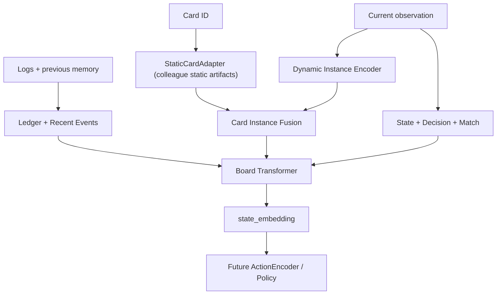

# Pokémon TCG AI Agent

本项目面向 Kaggle **The TCG AI Battle Challenge**，目标是在 `cabt` Pokémon TCG 模拟器中训练一个能够进行竞技对战的 Agent。

每个决策点，Agent 会收到当前公开局面、从上次选择以来的日志以及一组合法选项，并返回所选选项的索引。引擎已经保证选项合法，因此项目的核心不是复现规则，而是让模型学习：卡牌规则、当前局面价值、跨回合信息、对手公开信息以及长期决策策略。

## 项目目标

最终 Agent 需要完成以下过程：

```text
卡牌数据库 + 当前 observation + 历史公开信息
                      ↓
静态卡牌表示 + 动态卡牌实例 + 全局局面与时序记忆
                      ↓
局面表示 + 每个合法动作的结构化表示
                      ↓
动作评分 → 选择动作 → 对战
```

项目采用分层训练：

1. 先训练模型理解卡牌本身。
2. 再学习同一张卡在不同 HP、能量、区域和异常状态下的局面含义。
3. 使用 replay 重建 Ledger 与 Recent Events，学习完整公开状态。
4. 接入合法动作编码、行为克隆和 Value 学习。
5. 最后进行自博弈强化学习与提交评估。

## 比赛环境

- 模拟器：[`cabt`](https://matsuoinstitute.github.io/cabt/)
- Kaggle competition slug：`pokemon-tcg-ai-battle`
- Agent 输入：`observation.current`、`observation.logs`、`observation.select`
- Agent 输出：合法选项的索引序列
- 提交格式：顶层包含 `main.py` 和 `deck.csv` 的 `.tar.gz`
- 提交大小上限：197.7 MiB
- 运行资源：2 vCPU、12.2 GiB RAM、11.8 GiB 磁盘

排行榜按持续对战得到的 Skill Rating 排名。随机抽牌、硬币、隐藏手牌和不同牌组使问题同时包含不完全信息、概率和长期规划。

## 当前进度

| 模块 | 状态 | 当前结果 |
|---|---|---|
| 静态卡牌表示 | 等待导入 | 将完整采用 colleague 的 CSV 读取、聚合、特征、模型、训练和导出脚本；`static_card/` 当前仅为预留位置 |
| Observation / replay 解析 | 初版完成 | 支持变长 replay、公开性边界和 decision sample 构造 |
| 动态单卡表示 | 等待接入 | 结构化字段、动态 Cross-Attention 与辅助任务原型已实现，等待 colleague 静态产物接入 |
| Ledger / Recent Events | 原型 | 已有最小记忆接口，正式长期认知与幂等更新待完成 |
| Board Transformer | 原型 | 支持变长 [STATE]/[DECISION]/[MATCH]/Ledger/Event 及单卡实例表示，输出 state_embedding 提取完毕 |
| ActionEncoder / 行为克隆 / Value / PPO | 尚未进入主线 | 旧 PPO 代码仅作为历史 baseline |

当前处于静态模块替换阶段。根仓库负责 replay、动态实例、memory、Board、动作和策略；`StaticCardAdapter` 是唯一跨模块边界。真实 artifact contract 尚未确定，因此正式动态训练和 benchmark 均会 fail-fast，不会生成虚构静态特征或静默继续训练。



静态、动态、时序和动作层的完整职责见 [架构说明](docs/ARCHITECTURE.md)。

## 仓库结构

```text
static_card/                 colleague 完整静态模块的正式预留位置
data/                        observation/replay 数据结构与解析，动态卡牌 dataset
decks/                       原始牌组、Card ID 匹配结果与 baseline 牌组
models/                      动态实例、单卡融合、Board Transformer 与 StaticCardAdapter 边界
training/                    动态融合模型训练与评估
scripts/                     数据审计、牌组构造、benchmark 与 Kaggle 辅助脚本
tests/                       动态模型、观察解析、replay 相关的单元测试
configs/                     日期化的动态训练配置
experiments/                 与当前主线隔离的历史实验

kaggle/
├── builders/cg_runtime/     构建 cg runtime 的自包含 Kernel
├── datasets/cg_runtime/     cg runtime Dataset metadata 与本地生成内容
├── datasets/dynamic_code/   动态代码 Dataset metadata 与同步生成内容
├── kernels/replay_extract/  replay 与热门牌组提取 Kernel
└── kernels/dynamic_training/动态单卡训练 Kernel（当前暂停）

docs/                        当前文档
docs/reference/              字段审计与事实资料
```

正式源码位于根目录的 `data/`、`models/`、`training/` 和 `scripts/`。运行 `scripts/sync_kaggle_dynamic_code_dataset.py` 时，才会从正式源码生成 Kaggle 动态代码 Dataset；生成目录不提交 Git。

## 本地与忽略文件

下列内容保存在本地或 Kaggle，不提交到 GitHub：

- `outputs/`：按 `replay_extract/`、`dynamic_code_dataset/`、`dynamic_card_training/`、`benchmarks/` 和 `cg_runtime/` 分组的本地生成内容。
- `artifacts/`：CardRecord 与预处理缓存。
- `data_from_submission/`：replay 样例、审计结果和 decision dataset。
- `kaggle/datasets/cg_runtime/cg/`：用于发布的 `cg` Python runtime 与原生动态库。

这些文件的生成和挂载方式见 [Kaggle 工作流](docs/KAGGLE_WORKFLOW.md)。

## 文档入口

- [架构说明](docs/ARCHITECTURE.md)：模型各层、可见性边界和训练顺序。
- [项目状态](docs/STATUS.md)：已完成内容、真实缺口和下一步。
- [Kaggle 工作流](docs/KAGGLE_WORKFLOW.md)：数据集、kernel、训练与产物下载。
- [实验结论](docs/EXPERIMENT_HISTORY.md)：旧 PPO 失败原因、先后手观察和 oracle 方向。
- [状态字段审计](docs/reference/state_feature_audit.md)：`cabt` 字段、枚举和隐藏信息边界。

## 常用入口

测试：

```bash
python -m pytest -q
```

独立历史实验测试：

```bash
python -m pytest experiments/companion_csv_ppo/tests -q
```

项目采用 [MIT License](LICENSE)。

Kaggle 训练与部署命令集中维护在 [docs/KAGGLE_WORKFLOW.md](docs/KAGGLE_WORKFLOW.md)。
